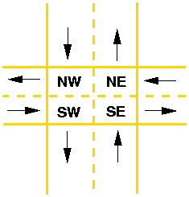

## Important Dates

**Due** Thursday, 03/05, midnight.


## Introduction

In this assignment you will implement synchronization primitives for
OS/161 and learn how to use them to solve a synchronization problem.
Once you have completed the written and programming exercises you
should have a fairly solid grasp of the pitfalls of concurrent
programming and, more importantly, how to avoid those pitfalls in the
code you will write later this semester. 

To complete this assignment you will need to be familiar with the
OS/161 thread code. The thread system provides interrupts, control
functions, and semaphores. You will implement locks. 


### Write readable code!

In your programming assignments, you are expected to write
well-documented, readable code. There are a variety of reasons to
strive for clear and readable code. Since you will be working in
pairs, it will be important for you to be able to read your partner's
code. Also, since you will be working on OS/161 for the entire
semester, you may need to read and understand code that you wrote
several months earlier. Finally, clear, well-commented code makes
your TA happy! 

There is no single right way to organize and document your code. It
is not our intent to dictate a particular coding style for this
class. The best way to learn about writing readable code is to read
other people's code. Read the OS/161 code, read your partner's code,
read the source code of some freely available operating system. When
you read someone else's code, note what you like and what you don't
like. Pay close attention to the lines of comments which most clearly
and efficiently explain what is going on. When you write code
yourself, keep these observations in mind. 

Here are some general tips for writing better code: 

* Group related items together, whether they are variable declarations, lines of code, or functions. 

* Use descriptive names for variables and procedures. Be consistent with this throughout the program. 

* Comments should describe the programmer's intent, not the actual
mechanics of the code. A comment which says `"Find a free disk
block"` is much more informative than one that says `"Find first
non-zero element of array."` 

You and your partner will probably find it useful to agree on a
coding style -- for instance, you might want to agree on how
variables and functions will be named (`my_function`, `myFunction`,
`MyFunction`, `mYfUnCtIoN`, `ymayUnctionFay`, etc.), since your code will
have to interoperate. 


## Begin your assignment

Before you do any real work on this assignment, tag your Git
repository. The purpose of tagging your repository is to make sure
that you have something against which to compare your final tree.
Make sure that you do not have any outstanding updates in your tree.
Use git pull, git add, and git commit to get your tree committed in
the state from which you want to begin this assignment. 

Now, tag your repository exactly as shown below. 

```bash
% cd ~/os161/os161-1.11
% git tag -a asst1-begin 
```

### Configure OS/161 for ASST1

 We have provided you with a framework to run your solutions for
`ASST1` (i.e., the Assignment #1 for OS/161). This framework consists
of driver code (found in `kern/asst1`) and menu items you can use to
execute your solutions from the OS/161 kernel boot menu. 

You have to reconfigure your kernel before you can use this
framework. The procedure for configuring a kernel is the same as in
`ASST0`, except you will use the `ASST1` configuration file: 

```bash
% cd ~/os161/os161-1.11/kern/conf
% ./config ASST1
```

You should now see an `ASST1` directory in the compile directory. 


### Building for ASST1

Edit the `build-asst0.php` file, on line 6, change `ASST0` to `ASST1`,
save the php file Run the php file using `php -f build-asst0.php`. This
will properly compile and build the kernel for `ASST1`. 

### Command line arguments to OS/161

Your solutions to `ASST1` will be tested by running OS/161 with
command line arguments that correspond to the menu options in the
OS/161 boot menu. 

> **IMPORTANT:** Please **DO NOT** change these menu option strings! 

### "Physical" memory

In order to execute the tests in this assignment, you will need more
than the 512 KB of memory configured into System/161 by default. We
suggest that you allocate at least 2 MB of RAM to System/161. This
configuration option is passed to the `busctl` device with the `ramsize`
parameter in your `sys161.conf` file. Make sure the `busctl` device line
looks like the following: 

```bash
  31 busctl ramsize=2097152
```

**Note:** 2097152 bytes is 2 MB. 


## Concurrent programming with OS/161

If your code is properly synchronized, the timing of context
switches and the order in which threads run should not change the
behavior of your solution. Of course, your threads may print messages
in different orders, but you should be able to easily verify that
they follow all of the constraints applied to them and that they do
not deadlock. 

### Built-in thread tests

When you booted OS/161 in `ASST0`, you may have seen the options to
run the thread tests. The thread test code uses the semaphore
synchronization primitive. You should trace the execution of one of
these thread tests in GDB to see how the scheduler acts, how threads
are created, and what exactly happens in a context switch. You should
be able to step through a call to `mi_switch()` and see exactly where
the current thread changes. 

Thread test 1 ( `"tt1"` at the prompt or `tt1` on the kernel command
line) prints the numbers 0 through 7 each time each thread loops.
Thread test 2 (`"tt2"`) prints only when each thread starts and exits.
The latter is intended to show that the scheduler doesn't cause
starvation -- the threads should all start together, spin for awhile,
and then end together.

### Debugging concurrent programs

`thread_yield()` is automatically called for you at intervals that
vary randomly. While this randomness is fairly close to reality, it
complicates the process of debugging your concurrent programs.  

The random number generator used to vary the time between these
`thread_yield()` calls uses the same seed as the random device in
System/161. This means that you can reproduce a specific execution
sequence by using a fixed seed for the random number generator. You
can pass an explicit seed into random device by editing the `"random"`
line in your `sys161.conf` file. For example, to set the seed to 1 ,
you would edit the line to look like: 

```bash
  28 random seed=1
```

We recommend that while you are writing and debugging your solutions
you pick a seed and use it consistently. Once you are confident that
your threads do what they are supposed to do, set the random device
to `autoseed`. This should allow you to test your solutions under
varying conditions and may expose scenarios that you had not
anticipated. 


## Written exercises (25 points)

Please answer the following questions and submit them with your
assignment in `code-reading.txt`. 

### Code reading

To implement synchronization primitives, you will have to understand
the operation of the threading system in OS/161. It may also help you
to look at the provided implementation of semaphores. When you are
writing solution code for the synchronization problems it will help
if you also understand exactly what the OS/161 scheduler does when it
dispatches among threads. 

Place the answers to the following questions in `code-reading.txt`.


&nbsp;&nbsp;&nbsp;&nbsp;&nbsp;&nbsp;&nbsp;&nbsp;**Thread questions**

1.  What happens to a thread when it exits (i.e., calls `thread_exit()`)? What about when it sleeps? 

2. What function(s) handle(s) a context switch? 

3. What does it mean for a thread to be in each of the possible thread states? 

4. What does it mean to turn interrupts off? How is this
accomplished? Why is it important to turn off interrupts in the
thread subsystem code? 

5. What happens when a thread wakes up another thread? How does a sleeping thread get to run again? 

	**Scheduler questions**

6. What function is responsible for choosing the next thread to run? 

7. How does that function pick the next thread? 

8. What role does the hardware timer play in scheduling? What hardware independent function is called on a timer interrupt?

	**Synchronization questions**

9. Describe how `thread_sleep()` and `thread_wakeup()` are used to
implement semaphores. What is the purpose of the argument passed to
`thread_sleep()`? 

10. Why does the lock API in OS/161 provide `lock_do_i_hold()`, but not `lock_get_holder()`? 


## Coding exercises (75 points)

### Synchronization primitives (20 points)

**Implement locks for OS/161.** The interface for the lock structure is
defined in `kern/include/synch.h`. Stub code is provided in
`kern/thread/synch.c`. You can use the implementation of semaphores as
a model, but **do not** build your lock implementation on top of
semaphores or you will be penalized. 

### Solving synchronization problems (55 Points)

The following problem will give you the opportunity to write some
fairly straightforward concurrent programs and get a more detailed
understanding of how to use threads to solve problems. We have
provided you with basic driver code that starts a predefined number
of threads. You are responsible for what those threads do. Remember
to specify a seed to use in the random number generator by editing
your `sys161.conf` file. It is much easier to debug initial problems
when the sequence of execution and context switches is reproducible. 


When you configure your kernel for `ASST1`, the driver code and extra
menu options for executing your solutions are automatically compiled
in.

You **MUST** solve this problem using **locks**. 

### Synchronization problem : Fairfax traffic problem

Traffic through the main intersection in the city of Fairfax, VA
(feel free to insert the name of your favorite town) has increased
over the past few years. Until now the intersection has been a
four-way stop but now the impending gridlock has forced the residents
of Fairfax to admit that they need a more efficient way for traffic to
pass through the intersection. Your job is to design and implement a
solution using any synchronization primitives you have implemented. 


<center>
  
</center>


### Modeling the intersection

For the purposes of this problem we will model the intersection as
shown above, dividing it into quarters and identifying each quarter
with which lane enters the intersection through that portion. (Just
to clarify: Fairfax is in the US, so we're driving on the right side
of the road.) Turns are represented by a progression through one,
two, or three portions of the intersection (for simplicity assume
that U-turns do not occur in the intersection). So if a car
approaches from the North, depending on where it is going, it
proceeds through the intersection as follows: 

* Right: NW
* Straight: NW-SW
* Left: NW-SW-SE

Before you begin coding, answer the follow questions in `exercises.txt`: 

1. Assume that the residents of Fairfax are exceptional and follow the
old (and widely ignored) convention that whoever arrives at the
intersection first proceeds first. Using the language of
synchronization primitives describe the way this intersection is
controlled. In what ways is this method suboptimal? 

2. Now, assume that the residents of Fairfax are like most people and
do not follow the convention described above. In what one instance
can this four-way-stop intersection produce a deadlock? (It will be
helpful to think of this in terms of the model we are using instead
of trying to visualize an actual intersection). 

### Implementing your solution

The file you are to work with is in `~/os161/src/kern/asst1`. Ignore
`catsem.c` and `catlock.c`. You only need to work with `stoplight.c`.

We have given you the model for the intersection. The following are
the requirements for your solution: 

* No two cars can be in the same portion of the intersection at the same time. (In Fairfax they call this an accident). 

* Residents of Fairfax do not pass each other going the same way. If
two cars both approach from the same direction and head in the same
direction, the first car to reach the intersection should be the
first to reach the destination. 

* Your solution must improve traffic flow without allowing traffic
from any direction to starve traffic from any other direction. 

* Each car should print a message as it approaches, enters, and
leaves the intersection indicating the car number, approach
direction and destination direction. 

The driver for the Fairfax traffic problem is in
`~/os161/src/kern/asst1/stoplight.c` (a not so subtle hint about one
possible solution). It consists of `createcars()` which creates 20 cars
and passes them to `approachintersection()` which assigns each a random
direction. We forgot to assign them a random turn direction; please
do this in `approachintersection()` as well. The file stoplight.c also
includes routines `gostraight()`, `turnright()` and `turnleft()` that may
or may not be helpful in implementing your solution. Use them or
discard them as you like. 


## What (and how) to hand in

You will submit your assignment in BlackBoard.   
When you are finished with this project, create a directory called `asst1`.  

```bash
% mkdir ~/os161/asst1
% cd ~/os161/asst1
```

Tag your latest working copy and run a diff (make sure you commit your latest working copy first!):

```bash
% git tag -a asst1-end
% git diff asst1-begin asst1-end > asst1.diff
```

In this directory, you should place the following: 

* `asst1.diff`: a diff file listing all the src changes you made for this assignment.

* your `sys161.conf` file.

* `code-reading.txt`: your answers to the code reading questions.

* `exercises.txt`: your answers to the written synchronization exercises. 


Next, tar and compress your `asst1` directory **AND** your entire source tree (i.e., `[src]`). 

```bash
% cd ~/os161
% tar -czf mygroup_asst1.tar.gz [src] asst1
```

Obviously, replace `mygroup` with you and your partner's Mason ID
(for examples: `msmith-jwatson-asst1.tar.gz` if you work as a group
of two). If
you are working alone, the last line should read `tar -czf
gid_asst1.tar.gz [src] asst1`. Replace `[src]` with the directory of your
entire os161 source tree (e.g., `os161-1.11`). 

You do not need to print out anything for this assignment. 
All members of a group must submit separately the same compressed file.
