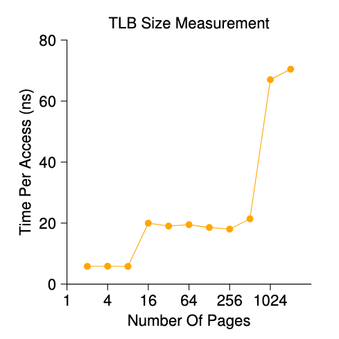

## Important Dates and Other Stuff

**Due** Thursday, 05/07, midnight.

**This project is to be done by yourself.**

In this project, you are to measure the size and cost of accessing a TLB. 
The idea is based on work by Saavedra-Barrera (...), who developed a 
simple but beautiful method to measure numerous aspects of cache hierarchies,
all with a very simple user-level program. Read his work for more details.

The basic idea is t access some number of pages within a large data
structure (e.g., an array) and to time those accesses. For example,
let's say the TLB size of a machine happens to be 4 (which would be
very small, but useful for the purpose of this discussion). If you
write a program that touches 4 or fewer pages, each access should be
a TLB hit, and thus relatively fast. However, once you touch 5 pages
or more, repeatedly in a loop, each access will suddenly jump in
cost, to that of a TLB miss.

The basic code to loop through an array once should look like this:

```c
	int jump = PAGESIZE / sizeof(int);
	for (i = 0; i < NUMPAGES * jump; i += jump) {
		a[i] += 1;
	}
```

In this loop, one integer per page of the array `a` is updated, up
to the number of pages specified by `NUMPAGES`. By timing such a loop 
repeatedly (say, a few hundred million times in another loop around this 
one, or however many loops are needed to run for a few seconds), you can
time how long each access takes (on average). By looking for jumps in cost
as `NUMPAGES` increases, you can roughly determine how big the first-level
TLB is, determine whether a second-level TLB exists (and how big it is if
it does), and in general get a good sense of how TLB hits and misses can 
affect performance.


<center>
  
</center>

The above figure shows the average time per access as the number of pages
accessed in the loop is increased. As you can see in the graph, when just
a few pages are accessed (8 or fewer), the average access time is roughly
5 nanoseconds (ns). When 16 or more pages are accessed, there is a sudden
jump to about 20 ns per access. A final jump in cost occurs at around 1024
pages, at which point each access takes around 70 ns. From this data, we can
conclude that there is a two-level TLB hierarchy; the first is quite small
(probably holding between 8 and 16 entries); the second is larger but slower
(holding roughly 512 entries). The overall difference between hits in the 
first-level TLB and misses is quite large, roughly a factor of fourteen.
TLB performance matters!!


## Questions, Steps, and Hints

For timing, you'll need to use a timer (e.g., `gettimeofday()`). 

**Q1** How precise is such a timer? How long does an operation have
to take in order for you to time it precisely? 

Write the program, called `tlb.c`, that can roughly measure the cost
of accessing each page. Inputs to the program should be: 
the number of pages to touch and the number of trials.

Now write a script in your favorite scripting language (bash?) to run
this program, while varying the number of pages accessed from 1 up to
a few thousand, perhaps incrementing by a factor of two per iteration.
Run the script on different machines (e.g., Zeus server and your only laptop, if possible)
and gather some data. 

**Q2** How many trials are needed to get reliable measurements?

Next, graph the results, making a graph that looks similar to the one
above. Use a good tool like `gnuplot` ([link](http://gnuplot.sourceforge.net/)) or `matplotlib`
([link](https://matplotlib.org/)). Visualization
usually makes the data much easier to digest; why do you think that
is?

One thing to watch out for is compiler optimization. Compilers do all 
sorts of clever things, including removing loops which increments values that
no other part of the program subsequently uses. 

**Q3** How can you ensure the compiler does not remove the main loop
above from your TLB size estimator?

Another thing to watch out for is the fact that most systems today ship
with multiple CPUs, and each CPU, of course, has its own TLB hierarchy. 
To really get good measurements, you have to run your code on just one 
single CPU, instead of letting the scheduler bounce it from one CPU to
another. 

**Q4** How can you do that? (hint: look up "pinning a thread" on Google
for some clues) What will happen if you don't do this, and the code moves
from one CPU to the other?

Yet another issue that might arise relates to initialization. If you 
don't initialize the array `a` above before accessing it, the first time
you access it will be very expensive, due to initial access costs such as 
demand zeroing. 

**Q5** Will this affect your code and its timing? What can you do to
counterbalance these potential costs?


## What (and how) to hand in

You will submit your assignment using GitLab. Go ahead and create a
new **private** repository named `TLB measurement`. The submission
will consist of whatever is contained in your **private** `TLB
measurement` repository. 

0. Prepare a document. Answer to the above questions. And then
provide a high-level description of how you approach the problem
(your measurement methodology) and a detailed description of the
implementation.  Your document should include the TLB access cost
graph, and you should discuss what you observed, and any insights /
implications you could draw from the results. (The document should be
similar to what you wrote for the previous project).

1. You will need to share your **private** repository with our GTA
Abhishek (his GitLab ID is the same as his Mason Email ID: `aroy6`).
Make sure to grant Abhishek a role of **"Developer"** or **"Maintainer"**.
"Guest" role permission does not grant access for some reason.
You can provide extra instructions about how your code can run on 
any other computers that you used for the measurement.
**NOTE:** Make sure, with the instructions provided, your code
can be compiled with no error and is runnable on Zeus.

2. Commit all your changes (including document, code, README, and
Makefile if any) by typing:

	```bash
% git commit -am 'the final awesome solution of proj3: [Your Name] and [Your GMU ID]'
	```

And that's all. We will check the timestamp (your last commit
timestamp) for late submission. So make sure to submit before the
deadline.


## Acknowledgment

The assignment borrows a considerable amount of content from OSTEP.
Thanks to Prof. Remzi Arpaci-Dusseau's support.


